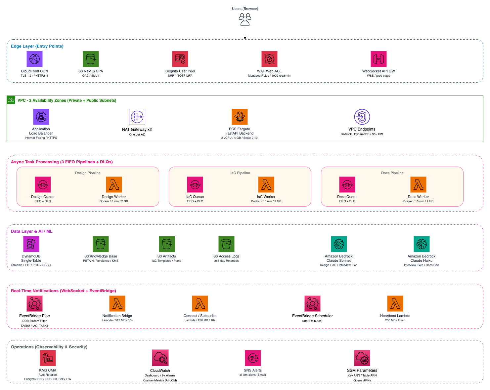

# AI Deploy Assistant

> **⚠️ Sample / Illustration repository — NOT production-ready.**
>
> This codebase is published as a reference implementation to illustrate a
> multi-agent deployment-assistant pipeline. It is **not** intended for direct
> production use. Before deploying anywhere beyond a sandbox, you are expected to
> conduct your own security review, complete the deferred posture items listed
> in [Security & Known Posture Items](#security--known-posture-items), harden
> IAM scoping, validate the prompt-injection surface, and add the operational
> controls (auth, audit, rate limiting, observability, DR) appropriate to your
> environment. The maintainers make no warranty as to fitness for any
> particular purpose.

A generalized, AI-powered product deployment assistant. Uses a multi-agent pipeline (Strands + Amazon Bedrock) to guide users through deploying any product catalog on AWS: gathering requirements via interview, generating architecture designs, producing Infrastructure-as-Code (CloudFormation), and creating documentation.

The system is **product-agnostic** — the product catalog, interview fields, deployment patterns, and validation rules are all driven by configuration files (`config.yaml` + `catalog.lock.yaml`), not hardcoded logic.



## Quick Start

```bash
# Install dependencies
cd backend && uv sync && cd ..
cd frontend && pnpm install && cd ..

# Configure environment
cp backend/.env.sample backend/.env
# Edit backend/.env — set AI_DEPLOY_AWS_REGION to your Bedrock-enabled region

# Start both services
./dev.sh
```

Backend: http://localhost:8000/ping | Frontend: http://localhost:3000

See [Local Development Guide](docs/local-development.md) for detailed setup.

## Architecture

```
Browser → Next.js Frontend (wizard UI)
           ↓ API calls
         FastAPI Backend (orchestrator)
           ├── Interview Agent (Haiku) → gathers requirements from user
           ├── Interview Planner (Sonnet) → plans questions from KB + catalog
           ├── Design Agent (Sonnet) → generates 3 architecture options
           ├── IaC Agent (Sonnet) → produces CloudFormation templates
           └── Documentation Agent (Sonnet) → diagrams, user guide, threat model
                    ↕
              Knowledge Base (Bedrock KB or Local files)
              + Catalog Lock File (deterministic field schema)
```

## Core Concepts

### Two Config Files

| File | Purpose | Maintained by |
|------|---------|---------------|
| `config.yaml` | Product identity + KB connection + policy overrides (~10 lines) | Developer (hand-edited) |
| `catalog.lock.yaml` | Full product schema — use cases, fields, patterns, appliance config | Generated from KB, reviewed + committed |

### 4-Stage Pipeline

1. **Interview** — AI-guided requirements gathering (fields from catalog)
2. **Design** — 3 architecture options grounded in KB documents
3. **IaC** — CloudFormation generation (parameterize, compose, or generate)
4. **Documentation** — Architecture diagram, user guide, threat model

### Knowledge Base Provider

The system supports three KB modes (auto-selected by config):

| Mode | When | How |
|------|------|-----|
| **Bedrock** | `AI_DEPLOY_KNOWLEDGE_BASE_ID` is set | AWS Bedrock KB API with vector search |
| **Local** | `knowledge_base.local_path` in config.yaml | TF-IDF search over local markdown files |
| **Null** | Neither configured | Graceful no-op (LLM uses built-in knowledge) |

## Project Structure

```
├── config.yaml              # Product identity (hand-edited)
├── catalog.lock.yaml        # Generated product schema (committed)
├── knowledge-base/          # Local KB documents (dev fallback)
│   ├── realtime-inference/  # use_case/deployment_type/doc_type.md
│   ├── batch-inference/
│   └── training/
├── backend/
│   └── src/
│       ├── config/          # Settings, catalog schema, app config
│       ├── agents/          # LLM agent implementations
│       ├── models/          # Pydantic data models
│       ├── services/        # Business logic (catalog loader, KB provider, etc.)
│       ├── tools/           # Agent tools (KB search, validation)
│       ├── prompts/         # Template prompt files ({product_name} variables)
│       ├── validation/      # cfn-lint, cfn-guard, checkov pipeline
│       └── routes/          # FastAPI endpoints
├── frontend/                # Next.js wizard UI
└── infra/                   # AWS CDK infrastructure
```

## Configuration Reference

See [Configuration Guide](docs/configuration-guide.md) for full schema documentation.

## Environment Variables

All env vars use the `AI_DEPLOY_` prefix. Key variables:

| Variable | Required | Description |
|----------|----------|-------------|
| `AI_DEPLOY_AWS_REGION` | Yes | AWS region for Bedrock and services |
| `AI_DEPLOY_KNOWLEDGE_BASE_ID` | No | Bedrock KB ID (omit for local KB) |
| `AI_DEPLOY_STORAGE_BACKEND` | No | `local` (default) or `aws` |
| `AI_DEPLOY_PRIMARY_MODEL_ID` | No | Bedrock model for design/planning |
| `AI_DEPLOY_LIGHTWEIGHT_MODEL_ID` | No | Bedrock model for interview execution |

See `backend/.env.sample` for the complete list.

## Development

```bash
# Run backend only
cd backend && uv run uvicorn src.main:app --reload

# Run tests
cd backend && uv run pytest tests/ -q

# Run frontend
cd frontend && pnpm dev
```

### Local Knowledge Base

For development without AWS Bedrock access, place documents in `knowledge-base/`:

```
knowledge-base/
  {use_case}/
    {deployment_type}/
      {document_type}.md    # architecture, sizing, configuration, etc.
```

The local KB provider indexes these files and performs TF-IDF text search with the same metadata filtering as Bedrock. Set `AI_DEPLOY_KNOWLEDGE_BASE_ID=""` to use local mode.

## Security & Known Posture Items

This repository is a sample. The list below tracks known posture items that are
intentionally deferred or suppressed with rationale. **Treat this as a starting
point for your own security review, not a sign-off.**

### Known deferred refactors

- **Bedrock Knowledge Base ARN scope** — The Lambda and ECS task IAM grants
  for `bedrock-agent-runtime:Retrieve` / `RetrieveAndGenerate` use a
  `knowledge-base/*` resource wildcard scoped to the deployment account+region.
  This is because the policy is generated before the KB ID is known. The
  recommended hardening is to thread the actual KB ID (or its CfnOutput-derived
  ARN) into the IAM grant so the wildcard is replaced with `knowledge-base/<id>`.
  Findings are suppressed in `infra/lib/lambda.ts` and `infra/lib/ecs.ts`
  with reference to this section. Tracked as a follow-up.

### Suppressed cdk-nag findings (with rationale at the suppression site)

- `AwsSolutions-APIG4` on WebSocket `$disconnect` and `subscribe` routes —
  API Gateway WebSocket APIs only accept authorizers on `$connect` (AWS
  platform constraint). Auth context propagates via `requestContext.authorizer`
  and the subscribe handler enforces tenant isolation. See
  `infra/lib/websocket.ts` and `backend/lambdas/ws/ws_subscribe.py`.
- `AwsSolutions-IAM4` on Lambda service roles — the AWS-managed
  `AWSLambdaBasicExecutionRole` and `AWSLambdaVPCAccessExecutionRole` are the
  canonical platform integrations. See `infra/lib/lambda.ts`.
- `AwsSolutions-IAM5` action wildcards on `kms:GenerateDataKey*` and
  `kms:ReEncrypt*` — these expand within the `kms:` namespace only and are
  resource-bound to the customer-managed key on the same statement. See
  `infra/lib/ecs.ts`.

### Other posture notes

- **Prompt-injection surface:** the design and IaC agents consume free-text
  user input and KB-derived content; before any external exposure you should
  add output filtering, response length caps, and review the agent tool
  surface for unintended side effects.
- **Lock files are committed** (`pnpm-lock.yaml`, `package-lock.json`,
  `uv.lock`). CI must use `npm ci` / `pnpm install --frozen-lockfile` /
  `uv sync --frozen` to enforce them.
- **SAST suppressions** are documented inline (`# nosec`, `# nosemgrep`) with
  rationale; see `.semgrep.yml` for the project-wide rule disables.

## Deployment

See [AWS Deployment Guide](docs/aws-deployment.md) for CDK-based production deployment.
