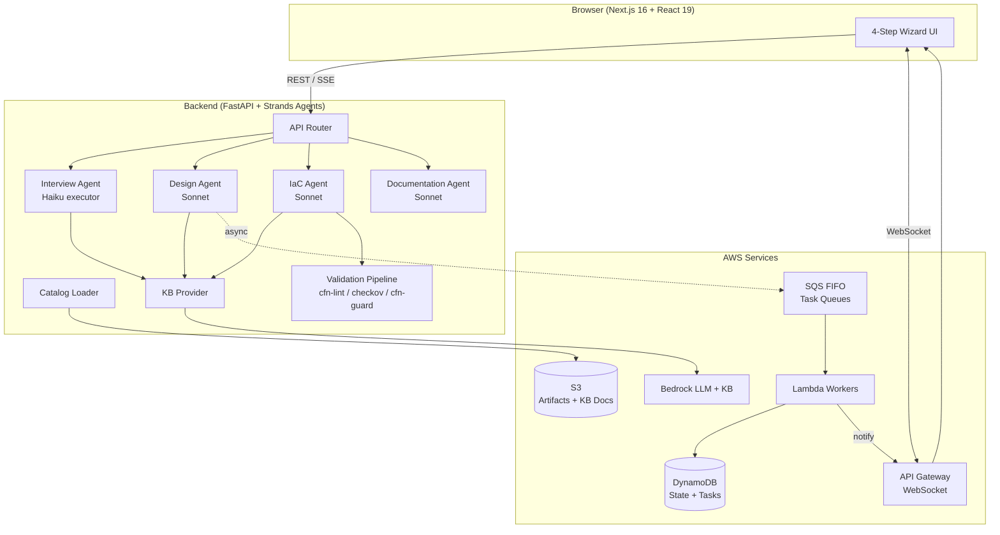
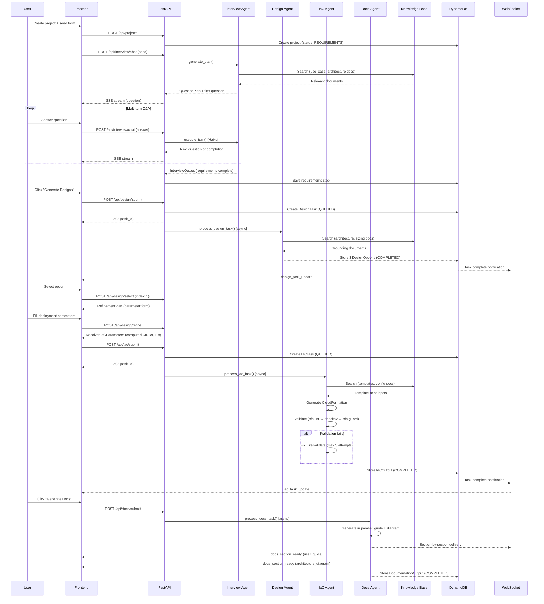
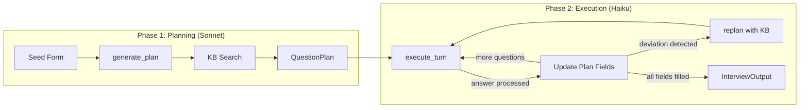
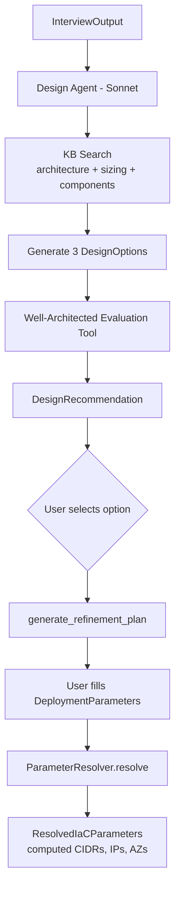
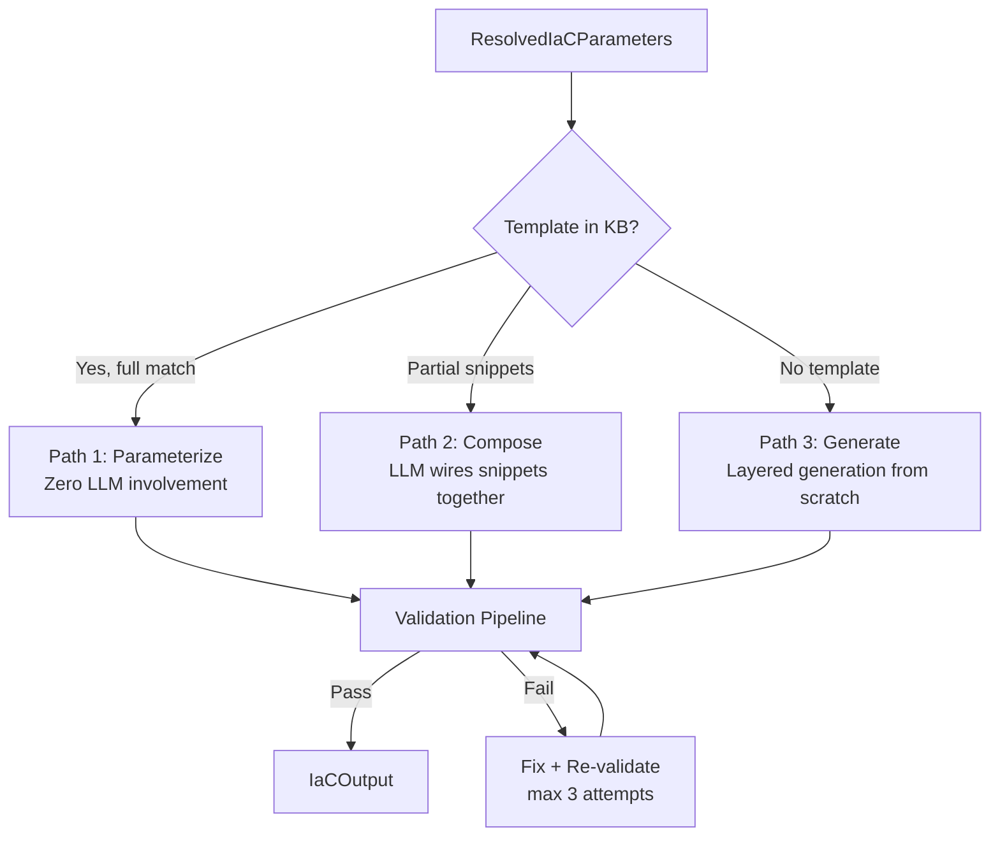
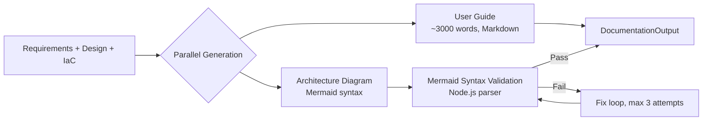
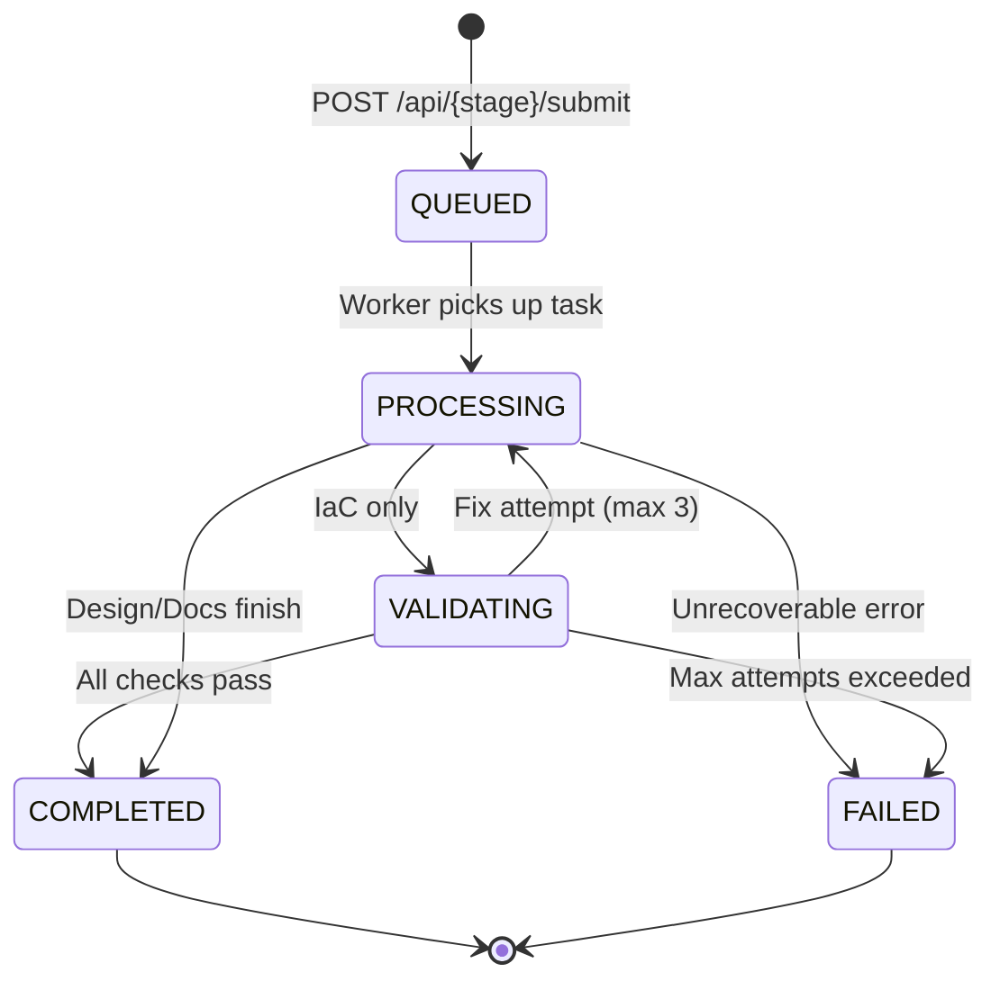
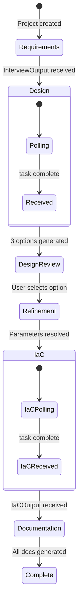
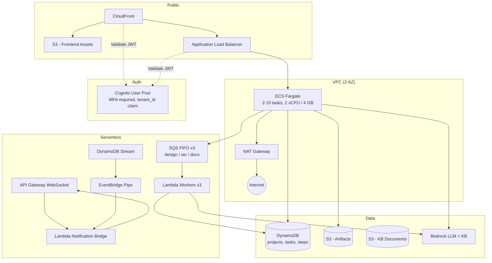

# AI Deploy Assistant — System Design Overview

> A walkthrough document for design review and handoff.

---

## 1. What Is AI Deploy Assistant?

AI Deploy Assistant is a **product-agnostic, AI-powered deployment wizard** that guides users through deploying any product on AWS. It uses a multi-agent pipeline (AWS Strands + Bedrock) to automate four stages:

1. **Interview** — Gather requirements through conversational Q&A
2. **Design** — Generate and evaluate 3 architecture options
3. **IaC** — Produce validated CloudFormation templates
4. **Documentation** — Generate deployment guides and architecture diagrams

The system is entirely **configuration-driven** — the product catalog, interview fields, deployment patterns, and validation rules come from `config.yaml` and `catalog.lock.yaml`, not hardcoded logic. Adding a new product requires only KB updates and catalog regeneration — no code changes.

---

## 2. High-Level Architecture



### Key Architectural Principles

| Principle | What It Means |
|-----------|---------------|
| **Product-Agnostic** | No hardcoded business logic. Everything driven by catalog + KB. |
| **Schema Enforces Grammar, KB Provides Vocabulary** | LLM picks from KB-defined patterns; code computes deterministic details (subnet CIDRs, IPs). |
| **Template-First, Generate-Fallback** | Check KB for existing CloudFormation templates before generating novel code. |
| **Plan is State, Not History** | Interview plan lives server-side. Each turn is stateless single-shot processing. |
| **Local-First Validation** | All IaC validation runs locally (no external dependencies). |
| **Hybrid Async/Sync** | Interview runs synchronously (SSE); Design/IaC/Docs run asynchronously (SQS + polling/WebSocket). |

---

## 3. End-to-End Request Flow

This sequence diagram shows the full lifecycle from project creation through documentation delivery:



---

## 4. Stage 1 — Interview Agent

The Interview Agent gathers requirements through a structured, multi-turn conversation. It uses a **two-phase architecture** that separates planning (expensive, smart) from execution (cheap, fast).

### Architecture



### How It Works

| Aspect | Detail |
|--------|--------|
| **Planning model** | Claude Sonnet — generates a `QuestionPlan` with all fields to collect |
| **Execution model** | Claude Haiku — processes one answer per turn (stateless, ~1-2s latency) |
| **State** | `QuestionPlan` lives server-side. The LLM never sees conversation history. |
| **Replanning** | If the user's answer reveals new requirements (e.g., adds a use case), Sonnet re-fetches KB and generates a new plan |
| **Completion** | When all blocking fields are populated → converts to `InterviewOutput` |
| **Communication** | SSE (Server-Sent Events) for streaming responses to frontend |

### Key Data Structures

**QuestionPlan** — Server-side state tracking what to ask:
```
fields: [{field_name, label, required, populated, value}, ...]
use_case_fields: {use_case_id → [{field_name, ...}]}
current_field_index: int
```

**InterviewOutput** — Final requirements passed to the Design stage:
```
use_cases, availability_requirement, data_sensitivity, compliance,
solution_description, user_info, use_case_details: {use_case → {field → value}}
```

### KB Usage

- **Query**: Use case names + solution description
- **Filters**: `document_type ∈ ["architecture", "components"]`
- **Purpose**: Ground the question plan in product-specific terminology and deployment options

> **Further reading**: `docs/interview-agent-design.md`

---

## 5. Stage 2 — Design Agent

The Design Agent generates **3 architecture options** grounded in KB documents, each evaluated against the AWS Well-Architected Framework.

### Architecture



### How It Works

| Aspect | Detail |
|--------|--------|
| **Model** | Claude Sonnet via Strands Agent |
| **Tools** | `kb_search()`, `evaluate_design_against_wa()` |
| **Output** | 3 `DesignOption` objects with topology, pros/cons, cost estimates |
| **Async** | Runs via SQS FIFO (prod) or background thread (dev) |
| **Notification** | WebSocket push on completion; frontend polls as fallback |

### Design Option Structure

Each option includes:
- **VPC topology** — roles (hub, spoke), subnet roles, AZ count
- **Appliance topology** — instances, interfaces, port mappings
- **KB references** — source documents with relevance scores
- **Template flag** — `has_code_template: true` if a pre-built CloudFormation template exists in KB
- **Ratings** — security posture (1-5), complexity (1-5), estimated cost

### Selection & Refinement Sub-flow

After the user selects an option:

1. **`POST /api/design/select`** → Backend generates a `RefinementPlan` (dynamic form fields based on the chosen architecture — e.g., Transit Gateway ASN, VPC CIDR ranges)
2. **`POST /api/design/refine`** → `ParameterResolver` deterministically computes:
   - Subnet CIDRs from VPC CIDR + topology
   - Private IPs for each appliance interface
   - Availability zone assignments
   - Naming conventions from catalog

This is a critical design decision: **networking math is never delegated to the LLM**. The resolver is pure Python with deterministic outputs.

> **Further reading**: `docs/design-agent-design.md`

---

## 6. Stage 3 — IaC Agent

The IaC Agent produces **validated CloudFormation templates**. It uses a **3-path resolution strategy** to maximize reliability:

### Resolution Paths



| Path | When | LLM Involvement | Hallucination Risk |
|------|------|-----------------|-------------------|
| **Parameterize** | Full template exists in KB | None — pure substitution | Zero |
| **Compose** | Reusable snippets exist | Wiring plan only | Low |
| **Generate** | Novel pattern | Full generation, layered | Managed via validation |

### Layered Generation (Path 3)

When no template exists, the agent generates CloudFormation in layers to keep each LLM call focused:

1. **Foundation** — VPCs, subnets, route tables, internet gateways
2. **Security** — Security groups, NACLs, IAM roles
3. **Compute** — EC2 instances, ENIs, EIPs
4. **HA** — Auto-scaling, failover, health checks
5. **Integration** — Transit Gateway, VPN, peering

Each layer is validated independently, then merged with cross-layer reference resolution.

### Validation Pipeline

Every generated template passes through **4 validation stages** (all local, no external deps):

| Stage | Tool | What It Checks | Blocking? |
|-------|------|----------------|-----------|
| Structural | Python YAML/JSON parser | Valid syntax | Yes |
| Linting | `cfn-lint` | Resource properties, types, refs | Yes |
| Security | `checkov` | CIS benchmarks, OWASP | Warning |
| Compliance | `cfn-guard` | Custom org rules | Warning |

On failure: the agent receives the error messages and regenerates the offending layer (up to 3 fix attempts).

### Output

```
IaCOutput:
  files: {template.yaml, rules.guard, outputs.json}
  validation_report: {passed, findings[], fix_attempts, layers_executed}
  template_resolution_path: "parameterize" | "compose" | "generate"
```

> **Further reading**: `docs/iac-agent-design.md`

---

## 7. Stage 4 — Documentation Agent

The Documentation Agent generates **2 artifacts in parallel** from the accumulated project state:

### Architecture



| Artifact | Model | Validation | Delivery |
|----------|-------|-----------|----------|
| **User Guide** | Sonnet | None (Markdown) | WebSocket section event |
| **Architecture Diagram** | Sonnet | Mermaid parser (Node.js) | WebSocket after validation |

### Incremental Delivery

Documentation sections are pushed to the frontend individually as they complete via WebSocket events:
```json
{"type": "docs_section", "section": "user_guide", "content": "..."}
```

This means the user sees results progressively — no waiting for all 3 to finish.

### Regeneration

Users can regenerate individual sections without re-running the full pipeline:
- `POST /api/docs/regenerate-section` with `{project_id, section: "user_guide"}`

> **Further reading**: `docs/documentation-agent-design.md`

---

## 8. Knowledge Base Architecture

The KB is the system's **grounding layer** — it prevents hallucination by giving agents factual product-specific documents to reference.

### Provider Interface

```python
class KnowledgeBaseProvider(Protocol):
    def search(query: str, filters: dict, max_results: int) -> list[KBResult]
```

| Implementation | When Used | How It Works |
|---------------|-----------|--------------|
| `BedrockKBProvider` | Production | Vector embeddings + metadata filtering via AWS Bedrock KB API |
| `LocalKBProvider` | Development | TF-IDF ranking on local files with path-based metadata |
| `NullKBProvider` | No KB configured | Returns empty results; LLM uses built-in knowledge |

### Document Organization (S3 / Local)

```
knowledge-base/
├── {use_case}/
│   ├── {deployment_pattern}/
│   │   ├── architecture.md       # High-level design docs
│   │   ├── sizing.yaml           # Instance recommendations
│   │   ├── configuration.md      # Product-specific config
│   │   └── code/
│   │       └── template.yaml     # Pre-built CloudFormation
│   └── components.md             # Shared component docs
└── best-practices.md             # Cross-cutting guidance
```

### How Each Agent Uses KB

| Agent | Searches For | Purpose |
|-------|-------------|---------|
| **Interview** | Architecture + component docs for selected use cases | Ground questions in real terminology |
| **Design** | Architecture + sizing + component docs | Generate topology options with citations |
| **IaC** | Templates + configuration docs for chosen pattern | Template match or generation grounding |
| **Docs** | Architecture + best-practices | Accurate deployment guidance |

> **Further reading**: `docs/knowledge-base-setup-guide.md`

---

## 9. Async Task System

Design, IaC, and Documentation stages run **asynchronously** to avoid blocking the API on long-running LLM calls (30-120 seconds).

### Task Lifecycle



### Production vs Development

| Concern | Production | Local Development |
|---------|-----------|-------------------|
| **Queue** | SQS FIFO (per-stage) | In-memory `queue.Queue` |
| **Worker** | Lambda function | Background thread |
| **Notification** | API Gateway WebSocket → EventBridge Pipe → Lambda bridge | Direct WebSocket push |
| **Persistence** | DynamoDB | Local JSON files |
| **Fallback** | Frontend polls if WebSocket drops | Same |

### Frontend Resilience

- **Primary**: WebSocket subscription for real-time task updates
- **Fallback**: Polls `GET /api/{stage}/task/{id}` every 3 seconds
- **Reconnection**: On page refresh, hydration endpoint resumes polling for active tasks
- **Timeout**: 3 minutes (design/IaC), 6 minutes (docs)

---

## 10. Frontend State Machine

The wizard UI is driven by a **reducer-based state machine** (`useWizardState` hook):



### Hydration

On mount (or browser refresh), the frontend calls `GET /api/projects/{id}/state` which returns the full wizard state. The reducer dispatches `HYDRATE` and resumes from wherever the user left off — including re-attaching to in-progress async tasks.

---

## 11. Configuration & Extensibility

### Two Configuration Files

| File | Purpose | Maintained By |
|------|---------|---------------|
| `config.yaml` | Product identity + KB connection (~10 lines) | Developer (hand-edited) |
| `catalog.lock.yaml` | Full product schema (generated, deterministic) | Generated from KB, reviewed + committed |

### What the Catalog Controls

- **Interview schema** — Base fields + use-case-specific fields
- **Appliance config** — Instance types, interface roles, naming patterns
- **Deployment patterns** — Available architectures with aliases and descriptions
- **KB search templates** — How to query the knowledge base per stage
- **Guardrails** — Focus topics and denied topics for LLM prompts

### Adding a New Product

1. Upload product documentation to S3 (or local `knowledge-base/` directory)
2. Update `config.yaml` with product name and vendor
3. Regenerate `catalog.lock.yaml` from KB content
4. Deploy — no code changes required

> **Further reading**: `docs/configuration-guide.md`

---

## 12. Infrastructure Overview

The system deploys on AWS using CDK v2 (TypeScript). Here is the high-level topology:



### Key Infrastructure Decisions

| Decision | Rationale |
|----------|-----------|
| **ECS Fargate** (not Lambda for API) | Long-running SSE connections for interview; WebSocket support |
| **SQS FIFO** (not Step Functions) | Simpler, cheaper; ordering guarantees per tenant |
| **DynamoDB** (not RDS) | Schemaless task storage, TTL-based cleanup, streams for events |
| **CloudFront + S3** (not ECS for frontend) | Static export (Next.js `output: export`), global CDN |
| **Cognito** | Managed auth with MFA, custom `tenant_id` attribute for multi-tenancy |

> **Further reading**: `docs/aws-deployment.md`

---

## 13. Security Model

| Layer | Mechanism |
|-------|-----------|
| **Authentication** | Cognito JWT (MFA required) |
| **Multi-tenancy** | `tenant_id` extracted from JWT; all DB queries scoped |
| **Encryption at rest** | KMS (DynamoDB, S3, SQS) |
| **Encryption in transit** | TLS 1.3 (ALB, CloudFront, VPC endpoints) |
| **Network isolation** | Private subnets for ECS; VPC endpoints for AWS services |
| **IaC security** | Checkov + cfn-guard validate generated templates |
| **Rate limiting** | `slowapi` on FastAPI routes |
| **WAF** | CloudFront WAF rules |

---

## 14. Local Development

```bash
./dev.sh   # Starts backend (port 8000) + frontend (port 3000)
```

In local mode:
- **No SQS/Lambda** — tasks process in-thread via background worker
- **No DynamoDB** — state stored as local JSON files
- **No Bedrock KB** — `LocalKBProvider` uses TF-IDF on `knowledge-base/` directory
- **Bedrock LLM** — still required (configure AWS credentials)

> **Further reading**: `docs/local-development.md`

---

## 15. Summary: What Makes This System Work

```
┌─────────────────────────────────────────────────────────┐
│  Config-Driven: catalog.lock.yaml defines the product   │
│  KB-Grounded: agents reference real docs, not hallucinate│
│  Deterministic Where Possible: networking math in Python │
│  Validated Output: every template passes 4-stage checks │
│  Resilient UX: WebSocket + polling + hydration          │
└─────────────────────────────────────────────────────────┘
```

The architecture separates **what changes per product** (KB content, catalog config) from **what stays the same** (agent logic, validation pipeline, infrastructure). This makes the system extensible without code changes while maintaining reliability through deterministic computation and multi-tier validation.

---

## Appendix: Further Reading

| Document | Covers |
|----------|--------|
| `docs/interview-agent-design.md` | Two-phase interview architecture, replanning logic |
| `docs/design-agent-design.md` | Design generation, Well-Architected evaluation, refinement |
| `docs/iac-agent-design.md` | 3-path resolution, layered generation, validation pipeline |
| `docs/documentation-agent-design.md` | Parallel doc generation, Mermaid validation |
| `docs/configuration-guide.md` | config.yaml and catalog.lock.yaml schemas |
| `docs/knowledge-base-setup-guide.md` | KB setup for Bedrock and local development |
| `docs/local-development.md` | Running the system locally |
| `docs/aws-deployment.md` | CDK deployment and production setup |
