# AI-LCM User Flow — Sequence Diagram

```mermaid
sequenceDiagram
    actor User as User (Browser)
    participant CF as CloudFront
    participant Cog as Cognito
    participant ECS as ECS Fargate<br/>FastAPI Backend
    participant KB as Bedrock<br/>Knowledge Base
    participant Sonnet as Claude Sonnet<br/>(Bedrock)
    participant Haiku as Claude Haiku<br/>(Bedrock)
    participant DDB as DynamoDB<br/>Single-Table
    participant S3 as S3 Artifacts
    participant SQS as SQS FIFO<br/>Queues
    participant LW as Lambda<br/>Workers (Docker)
    participant Notify as EventBridge Pipe<br/>+ WS Bridge Lambda
    participant WS as WebSocket<br/>API Gateway

    Note over User,WS: All Bedrock calls route through VPC Endpoints (never public internet)

    %% ═══════════════════════════════════════════════════════
    %% PHASE 1: AUTHENTICATION
    %% ═══════════════════════════════════════════════════════
    rect rgb(235, 245, 255)
        Note over User,Cog: PHASE 1 — Authentication
        User->>+CF: HTTPS request
        CF->>CF: TLS 1.2+ / Security Headers
        CF->>-User: Next.js SPA (S3 via OAC)
        User->>+Cog: SRP authentication
        Cog->>User: MFA challenge (TOTP)
        User->>Cog: TOTP code
        Cog->>-User: JWT tokens (ID + Access, 1hr TTL)
    end

    %% ═══════════════════════════════════════════════════════
    %% PHASE 2: REQUIREMENTS INTERVIEW
    %% ═══════════════════════════════════════════════════════
    rect rgb(255, 245, 235)
        Note over User,Haiku: PHASE 2 — Requirements Interview (SSE Streaming, ~12-20s total)

        Note right of User: Turn 1: Planning Phase (~5-8s)
        User->>+ECS: POST /api/interview/chat<br/>{seed_data, use_case, project_id}
        Note right of ECS: Rate limit: 10 req/min
        ECS->>+KB: Level-1 KB Search<br/>filter: use_case + [architecture, components]
        KB-->>-ECS: 5-8 KB chunks
        ECS->>+Sonnet: Generate QuestionPlan<br/>(structured output: QuestionPlanOutput)
        Note right of Sonnet: Auto-fill fields from KB<br/>Generate ordered questions<br/>with skip conditions
        Sonnet-->>-ECS: QuestionPlan + auto-fills + Q1
        ECS->>S3: Persist plan JSON<br/>({tenant}/{project}/state/)
        ECS-->>-User: SSE stream: auto-fills + first question<br/>(with input_hint for frontend)

        Note right of User: Turns 2+: Execution Phase (~1-2s each)
        loop Each question (single-shot, no history)
            User->>+ECS: POST /api/interview/chat {answer}
            ECS->>+Haiku: Execute turn (single-shot)<br/>{question + answer + KB context}
            Haiku-->>-ECS: TurnResponse<br/>{parsed_value, confidence, response}
            alt confidence < 0.5
                Note right of ECS: Re-ask same question<br/>with clarification hint
            else confidence >= 0.5
                ECS->>ECS: mark_answered + evaluate_skip_conditions
            end
            ECS->>DDB: Save plan state
            ECS->>S3: Update plan JSON
            ECS-->>-User: SSE: acknowledgment + next question
        end

        opt Curveball: User deviates from plan (~5-8s)
            Note right of ECS: Haiku detects deviation
            ECS->>+KB: Level-3 Re-search<br/>filter: use_case + deployment_type
            KB-->>-ECS: Updated KB chunks
            ECS->>+Sonnet: Re-plan (keep answered,<br/>replace pending questions)
            Sonnet-->>-ECS: Updated QuestionPlan
        end

        Note right of User: Interview complete
        ECS->>DDB: Save requirements (step: "requirements")
        ECS->>S3: Persist final plan
        ECS-->>User: SSE: complete=true + full requirements
    end

    %% ═══════════════════════════════════════════════════════
    %% PHASE 3: DESIGN GENERATION (ASYNC)
    %% ═══════════════════════════════════════════════════════
    rect rgb(235, 255, 240)
        Note over User,WS: PHASE 3 — Design Generation (Async, ~30-120s)

        User->>+ECS: POST /api/design/submit
        ECS->>DDB: Create TASK# record (status: QUEUED)
        ECS->>SQS: Enqueue to ai-lcm-design-tasks.fifo<br/>MessageGroupId: {tenant}#{project}
        ECS-->>-User: HTTP 202 + task_id

        User->>+WS: WSS connect
        WS-->>-User: connection_id stored in DDB
        User->>+WS: subscribe {project_id}
        WS-->>-User: subscribed

        SQS->>+LW: Trigger ai-lcm-design-worker (5 min timeout)
        LW->>DDB: Read requirements
        LW->>+KB: Search architecture + sizing docs
        KB-->>-LW: Grounded context with citations
        LW->>+Sonnet: Generate 3 DesignOptions<br/>(structured output with KB refs)
        Note right of Sonnet: Each option includes:<br/>- Topology blueprints<br/>- Well-Architected scores<br/>- KB citations<br/>- Cost estimates
        Sonnet-->>-LW: 3 DesignOptions
        LW->>DDB: Save result (status: COMPLETED)
        deactivate LW

        DDB-)Notify: DynamoDB Stream<br/>(MODIFY + TASK# + completed)
        Notify->>DDB: Lookup subscribed connections
        Notify->>WS: POST /@connections/{id}
        WS-->>User: WS push: "design_completed"

        User->>+ECS: GET /api/design/task/{task_id}
        ECS->>DDB: Read design result
        ECS-->>-User: 3 DesignOptions<br/>(topology, scores, citations)
    end

    %% ═══════════════════════════════════════════════════════
    %% PHASE 4: SELECTION & REFINEMENT
    %% ═══════════════════════════════════════════════════════
    rect rgb(245, 240, 255)
        Note over User,Haiku: PHASE 4 — Design Selection & Parameter Refinement

        User->>+ECS: POST /api/design/select {option_index}
        ECS->>DDB: Save selected design
        ECS-->>-User: Selection confirmed

        User->>+ECS: POST /api/design/refine
        ECS->>+KB: Pattern-specific config docs
        KB-->>-ECS: Configuration details
        ECS->>+Haiku: Analyze: required params + KB defaults
        Haiku-->>-ECS: DeploymentParameters schema
        ECS-->>-User: Dynamic form (pre-populated)

        User->>+ECS: POST /api/design/refine<br/>{deployment_parameters: CIDRs, region, license...}
        Note right of ECS: Deterministic ParameterResolver:<br/>- Subnet CIDRs from VPC CIDR + AZ count<br/>- FortiGate interface IPs<br/>- AMI lookup (region + version)<br/>- Security group rules<br/>- Route tables, IAM, bootstrap
        ECS->>DDB: Save ResolvedIaCParameters
        ECS-->>-User: Parameters resolved
    end

    %% ═══════════════════════════════════════════════════════
    %% PHASE 5: IaC GENERATION (ASYNC)
    %% ═══════════════════════════════════════════════════════
    rect rgb(255, 255, 235)
        Note over User,WS: PHASE 5 — IaC Generation (Async, ~2-15 min)

        User->>+ECS: POST /api/iac/submit
        ECS->>DDB: Create IAC_TASK# record (QUEUED)
        ECS->>SQS: Enqueue to ai-lcm-iac-tasks.fifo
        ECS-->>-User: HTTP 202 + task_id

        SQS->>+LW: Trigger ai-lcm-iac-worker (15 min timeout)
        LW->>DDB: Read design + resolved params

        alt Path 1: KB Template Match (zero LLM)
            LW->>S3: Fetch KB template
            Note right of LW: Pure Python parameterization<br/>No Bedrock calls needed
        else Path 2: Snippet Composition
            LW->>S3: Fetch CFT snippets
            LW->>+Sonnet: Generate SnippetAssemblyPlan
            Sonnet-->>-LW: Wiring plan (JSON)
            Note right of LW: Deterministic merge
        else Path 3: Layered Generation (most complex)
            LW->>+Sonnet: Decompose → LayerPlan
            Sonnet-->>-LW: 5 layers: Foundation, Security,<br/>Compute, HA, Integration

            par Parallel layer generation
                LW->>Sonnet: Foundation → ResourcePlan
            and
                LW->>Sonnet: Security → ResourcePlan
            and
                LW->>Sonnet: Compute → ResourcePlan
            and
                LW->>Sonnet: HA → ResourcePlan
            and
                LW->>Sonnet: Integration → ResourcePlan
            end

            Note right of LW: Spec validation per resource
            Note right of LW: Deterministic merge +<br/>cross-layer !Ref / !GetAtt
        end

        Note right of LW: Multi-tier validation:<br/>1. Structural checks<br/>2. cfn-lint<br/>3. checkov<br/>4. cfn-guard (Fortinet rules)

        loop Validation-fix loop (up to 3x per layer)
            LW->>+Sonnet: Fix errors (targeted per layer)
            Sonnet-->>-LW: Fixed ResourcePlan
        end

        LW->>S3: Store template.json + params
        LW->>DDB: Save IaCOutput (COMPLETED)
        deactivate LW

        DDB-)Notify: Stream (MODIFY + IAC_TASK# + completed)
        Notify->>WS: Push notification
        WS-->>User: WS push: "iac_completed"
    end

    %% ═══════════════════════════════════════════════════════
    %% PHASE 6: DOCUMENTATION (ASYNC)
    %% ═══════════════════════════════════════════════════════
    rect rgb(235, 255, 250)
        Note over User,WS: PHASE 6 — Documentation Generation (Async, ~1-5 min)

        User->>+ECS: POST /api/docs/submit
        ECS->>DDB: Create DocsTask (QUEUED)
        ECS->>SQS: Enqueue to ai-lcm-docs-tasks.fifo
        ECS-->>-User: HTTP 202 + task_id

        SQS->>+LW: Trigger ai-lcm-docs-worker (10 min timeout)
        LW->>DDB: Read design + requirements + CFT template

        par asyncio.gather() — 3 parallel sections
            LW->>+Haiku: Architecture Diagram<br/>(Mermaid, 16k tokens)
            Haiku-->>-LW: Mermaid code
            loop Validate-fix (up to 3x)
                LW->>LW: Node.js mermaid.parse()
                opt Validation fails
                    LW->>+Haiku: Fix diagram + error msg
                    Haiku-->>-LW: Fixed Mermaid
                end
            end
            LW-)Notify: docs_section: "architecture_diagram"
            Notify->>WS: Push section
            WS-->>User: Progressive: diagram arrives
        and
            LW->>+Haiku: User Guide<br/>(~3000 words, 32k tokens)
            Haiku-->>-LW: Deployment guide (Markdown)
            LW-)Notify: docs_section: "user_guide"
            Notify->>WS: Push section
            WS-->>User: Progressive: guide arrives
        and
            LW->>+Haiku: STRIDE Threat Model<br/>(~3000 words, 32k tokens)
            Haiku-->>-LW: Threat model (Markdown)
            LW-)Notify: docs_section: "threat_model"
            Notify->>WS: Push section
            WS-->>User: Progressive: threat model arrives
        end

        LW->>DDB: Save DocumentationOutput (COMPLETED)
        deactivate LW

        DDB-)Notify: Stream (MODIFY + completed)
        Notify->>WS: Push notification
        WS-->>User: WS: "docs_complete"
    end

    %% ═══════════════════════════════════════════════════════
    %% BACKGROUND: HEARTBEAT
    %% ═══════════════════════════════════════════════════════
    rect rgb(245, 245, 245)
        Note over DDB,WS: BACKGROUND — WebSocket Heartbeat (every 5 min)
        Note right of Notify: EventBridge Scheduler<br/>rate(5 minutes)
        Notify->>DDB: Scan active connections
        loop Each connection
            Notify->>WS: Ping connection
            alt GoneException (stale)
                Notify->>DDB: Delete connection record
            end
        end
    end
```

## Timing Summary

| Phase | Duration | Model | Pattern |
|-------|----------|-------|---------|
| 1. Auth | ~2-5s | - | Cognito SRP + TOTP |
| 2. Interview Turn 1 | ~5-8s | Sonnet | SSE streaming (plan generation) |
| 2. Interview Turn 2+ | ~1-2s each | Haiku | SSE streaming (single-shot execution) |
| 2. Interview Curveball | ~5-8s | Sonnet | KB re-search + re-plan |
| 2. Interview Total | ~12-20s | Mixed | 5-10 turns typical |
| 3. Design Generation | ~30-120s | Sonnet + KB | Async: SQS → Lambda → WebSocket |
| 4. Selection + Refinement | ~5-10s | Haiku | Synchronous (deterministic resolution) |
| 5. IaC Generation | ~2-15 min | Sonnet | Async: 3-path resolution + validation |
| 6. Documentation | ~1-5 min | Haiku (x3) | Async: 3 parallel sections + progressive WS |

## Key Architectural Patterns

- **Interview**: Plan-then-Execute — Sonnet plans, Haiku executes (single-shot, no history)
- **Design/IaC/Docs**: Async SQS → Lambda pattern with WebSocket push notifications
- **Notifications**: DynamoDB Stream → EventBridge Pipe → WS Bridge → API Gateway → Browser
- **IaC**: Three-path resolution (KB template → snippet composition → layered generation)
- **Docs**: `asyncio.gather()` for 3 parallel LLM calls with progressive WebSocket rendering
- **Resilience**: Circuit breaker + `@bedrock_retry` (3 attempts) + SQS DLQ (3 retries)
